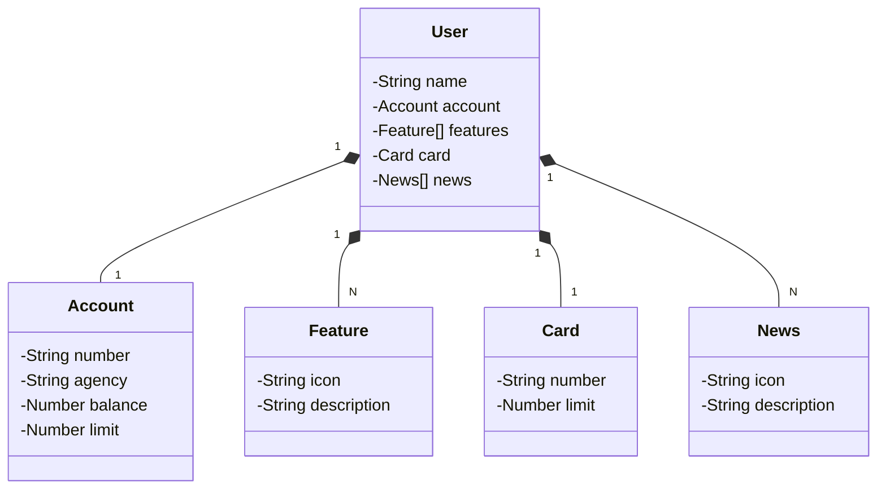

# Apresentação
Sistema de tela inicial de um aplicativo bancário, por meio de uma API RESTful Java com sistema de banco de dados e deploy em nuvem

## Tecnologias
- Java 17:
  -  Ferramenta robusta para desenvolvimento de software com paradigma de Programação Orientada á Objeto (POO)
- SpringBoot 3.1.2:
  - Framework Spring permite uma otimização no desenvolvimento de API's por fornecer uma excelente estrutura de autoconfiguração para inversão de controle e injeção de dependências
- SpringDataJPA:
  - Auxilia no processo de persistência de dados, simplificando o processo de requisições e consultas á um banco de dados SQL
- Gradle:
  - Gerenciamento de Build
- Banco de Dados:
  - Postegres
    - Pesistência de dados relacional em SQL
  - H2
    - Para teste de persistência rápidos e simples
- OpenAPI (Swagger):
  - Documentação, consumo e teste da aplicação, através de uma interface simples
- Railway
  - Plataforma que permite provicionamento de banco de dados
  - Possibilita serviço de integração com o repositório do projeto e realizar deploy das alterações
  - Acesso de domínio público: https://deployer-api.up.railway.app/swagger-ui/index.html

## Diagrama de Classes

